# Portfolio Website Architecture

## Component Hierarchy

```
App
├── Navigation
│   ├── Logo
│   ├── NavLinks
│   └── MobileMenu
├── ScrollProgress
├── Hero
│   ├── AnimatedText
│   ├── CTAButtons
│   └── ScrollIndicator
├── About
│   ├── ProfileImage
│   ├── StoryText
│   └── PrincipleCards
│       └── PrincipleCard (x3)
├── Skills
│   ├── CategoryGrid
│   └── SkillCard (multiple)
│       ├── CategoryIcon
│       └── SkillList
├── Projects
│   ├── FilterButtons
│   ├── ProjectGrid
│   │   └── ProjectCard (x4-6)
│   └── ProjectModal
│       ├── ImageGallery
│       ├── ProjectDetails
│       └── ActionButtons
├── Contact
│   ├── ContactForm
│   │   ├── FormField (x3)
│   │   └── SubmitButton
│   └── ContactInfo
│       └── SocialLinks
├── Footer
└── EasterEggs
    ├── KonamiCode
    ├── CursorTrail
    └── ClickCounter
```

## Data Flow

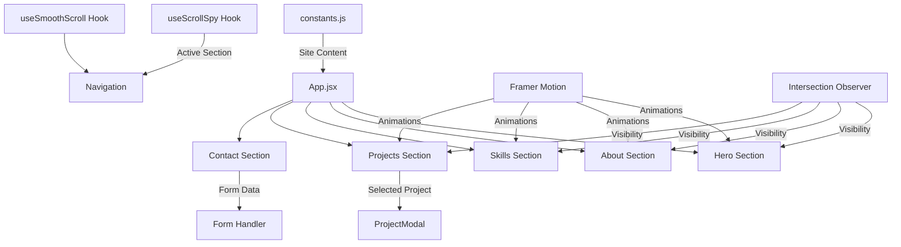

## State Management

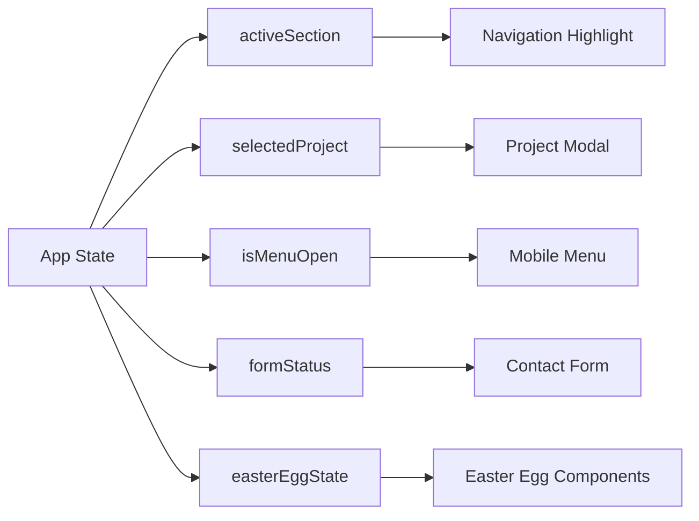

## File Organization

```
src/
├── components/
│   ├── common/              # Reusable UI components
│   │   ├── Button.jsx
│   │   ├── Card.jsx
│   │   ├── Grid.jsx
│   │   └── Section.jsx
│   ├── layout/              # Layout components
│   │   ├── Navigation.jsx
│   │   ├── Footer.jsx
│   │   └── ScrollProgress.jsx
│   ├── sections/            # Page sections
│   │   ├── Hero.jsx
│   │   ├── About.jsx
│   │   ├── Skills.jsx
│   │   ├── Projects.jsx
│   │   └── Contact.jsx
│   └── easter-eggs/         # Fun interactive elements
│       ├── KonamiCode.jsx
│       ├── CursorTrail.jsx
│       └── ClickCounter.jsx
├── hooks/                   # Custom React hooks
│   ├── useScrollSpy.js
│   ├── useSmoothScroll.js
│   ├── useMediaQuery.js
│   └── useKonamiCode.js
├── utils/                   # Utility functions
│   ├── animations.js        # Framer Motion variants
│   └── constants.js         # Site content & config
├── styles/                  # Global styles
│   ├── design-system.css    # CSS variables
│   ├── typography.css       # Font styles
│   └── utilities.css        # Utility classes
├── App.jsx                  # Main app component
├── main.jsx                 # Entry point
└── index.css                # Global base styles
```

## Technology Stack

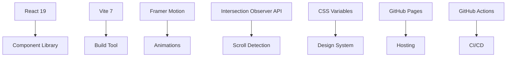

## Performance Strategy

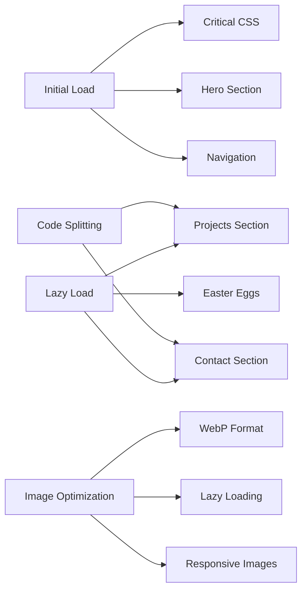

## Responsive Breakpoints

```
Mobile:     320px - 639px   (1 column)
Tablet:     640px - 1023px  (2 columns)
Desktop:    1024px - 1279px (3 columns)
Large:      1280px+         (4 columns)
```

## Animation Timeline

```mermaid
gantt
    title Page Load Animation Sequence
    dateFormat X
    axisFormat %Ls
    
    section Hero
    Fade in background    :0, 300
    Slide in heading      :200, 600
    Slide in subheading   :400, 800
    Fade in CTA buttons   :600, 1000
    
    section Navigation
    Fade in nav           :0, 400
    
    section Scroll Trigger
    About section reveal  :crit, 1500, 2100
    Skills cards stagger  :crit, 2000, 2800
    Projects grid reveal  :crit, 2500, 3300
```

## User Interaction Flow

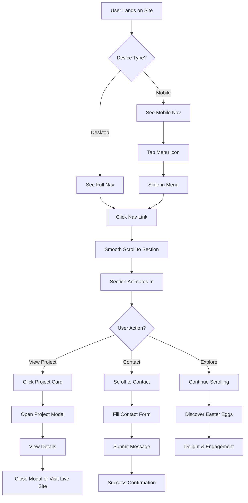

## Deployment Pipeline

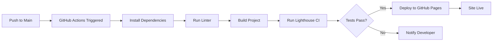

## SEO & Metadata Structure

```
HTML Head
├── Title Tag
├── Meta Description
├── Meta Keywords
├── Open Graph Tags
│   ├── og:title
│   ├── og:description
│   ├── og:image
│   ├── og:url
│   └── og:type
├── Twitter Card Tags
│   ├── twitter:card
│   ├── twitter:title
│   ├── twitter:description
│   └── twitter:image
├── Canonical URL
├── Favicon
└── Theme Color
```

## Accessibility Features

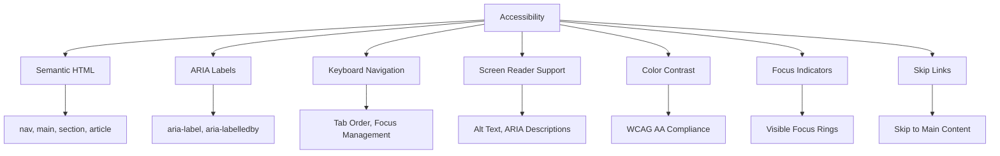

## Easter Egg Triggers

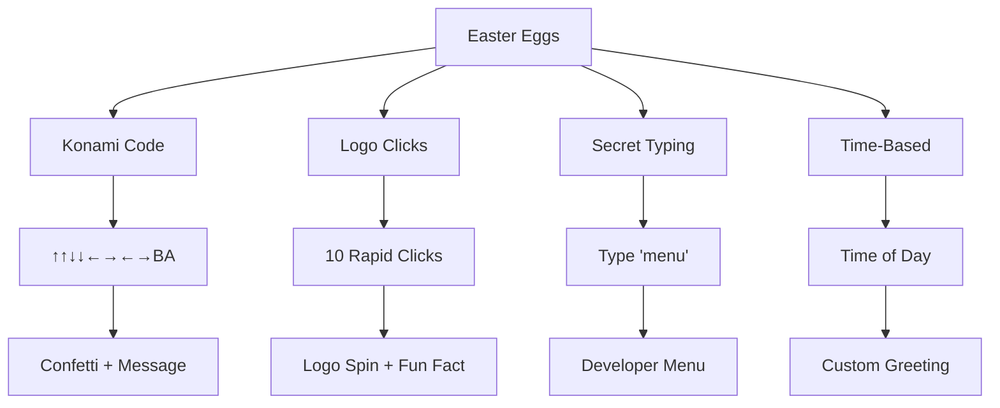

## Performance Budget

```
Target Metrics:
├── First Contentful Paint: < 1.5s
├── Largest Contentful Paint: < 2.5s
├── Time to Interactive: < 3.5s
├── Total Bundle Size: < 200KB (gzipped)
├── Image Size: < 200KB per image
└── Lighthouse Score: > 90
```

## Browser Support

```
Supported Browsers:
├── Chrome: Last 2 versions
├── Firefox: Last 2 versions
├── Safari: Last 2 versions
├── Edge: Last 2 versions
└── Mobile Safari: iOS 12+
```

## Development Workflow

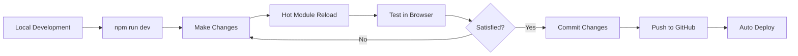

## Content Update Process

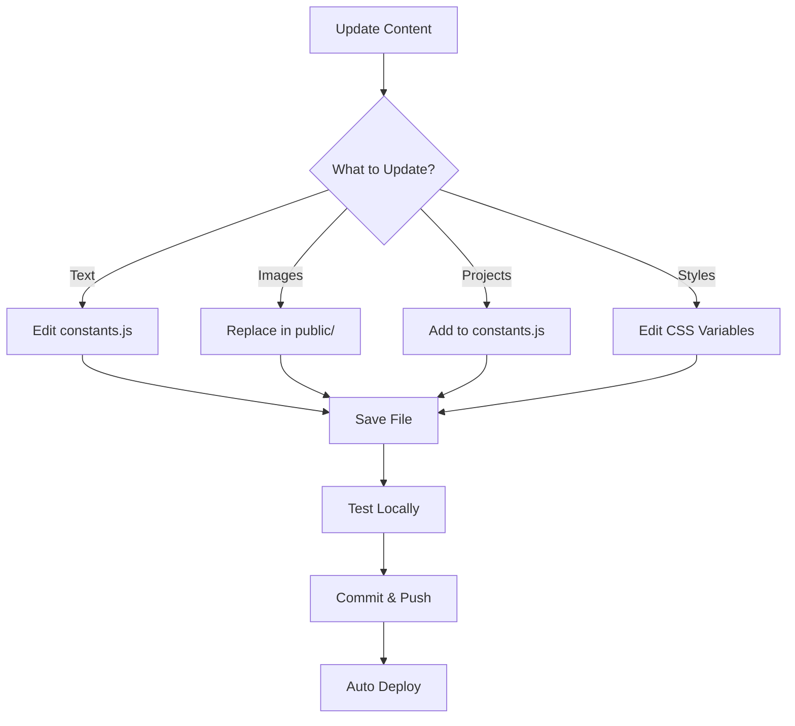

---

This architecture provides a clear blueprint for building your portfolio website with a focus on maintainability, performance, and user experience.